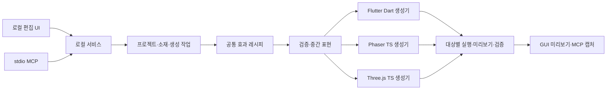

# 구조 제안

> 이 문서는 목표 설계입니다. 현재 구현과 차이는 [구현 상태](implementation-status.md), 현재 도구 입력은 [MCP 계약](mcp-contract.md)을 기준으로 확인하세요.
상태: 초기 목표 설계. 현재 v0.3 구현의 축소된 디렉터리·추가된 기능은 구현 상태 문서를 따른다. TypeScript 기반 로컬 제작 도구와 대상별 코드 생성기를 제안한다. Flutter 산출물과 실행 어댑터는 Dart로 작성한다. 프레임워크·SDK 버전은 구현 시 확인하고 고정한다.

## 핵심 경계

GUI와 MCP는 같은 프로젝트 명령과 생성 파이프라인을 호출한다. 공통으로 소유하는 것은 **효과의 의미·시간 계산 규약·검증·생성 입력**이다. 서로 다른 엔진의 실제 렌더 코드는 대상별로 분리한다.



도구는 단일 로컬 서비스가 저장을 소유한다. 생성된 게임 코드는 이 서비스나 MCP에 의존하지 않는다. 에이전트도 UI 자동 클릭 없이 생성 기능을 사용한다.

## 모듈과 소유권

| 모듈 | 책임 | 불변 조건 |
| --- | --- | --- |
| 프로젝트 | 레시피·소재 참조·target profile·revision | expectedRevision 일치 시만 수정 |
| 소재 | 입력 이미지·폰트 사본·해시·출처 | 원본 보존; 소재 ID를 통한 참조 |
| 효과 모델 | 텍스트·배경 속성, 타임라인, easing·seed | 효과 수학·단위·경계 시점 명시 |
| 컴파일러 | 레시피 검증, 중간 표현, 대상 지원 여부 판정 | 미지원 동작을 조용히 버리지 않음 |
| 생성기 | 대상별 소스·보조 파일·통합 예제 | 동일 입력·생성기 버전이면 동일 코드 |
| 실행 하네스 | 생성 결과의 실제 실행·시간 이동·캡처 | 생성 결과와 다른 데모 구현으로 대체 금지 |
| 생성·검증 작업 | 입력 스냅샷·상태·manifest·진단 | 시작 revision 고정; 생성 성공과 검증 성공 분리 |

프로젝트 ID별 명령 큐와 revision 비교로 변경을 직렬화한다. 별도 분산 Actor 프레임워크는 필요하지 않다. 파일 저장은 임시 파일 작성 후 원자적 교체를 기본으로 검토한다.

## 제안 폴더 구조

아래는 초기 분리안이다. 실제 구현은 packages/core, packages/generators, apps/local-service 및 runtimes 아래 파일로 구성한다.

```text
apps/
  editor/                       # 편집 UI, 대상 선택, 코드 보기
  local-service/                # 로컬 API, 저장, 작업 조립
  mcp/                          # stdio 어댑터
packages/
  core/
    projects/
    assets/
    generation/                 # 생성·검증 작업
    ports/                      # 저장·실행 프로세스 포트
  effect-schema/                # 레시피, 타임라인, 지원 capability
  effect-compiler/               # 검증·정규화·중간 표현
  generators/
    flutter/                    # Dart 소스 생성
    phaser/                     # TypeScript 소스 생성
    three/                      # TypeScript 소스 생성
  contracts/                    # UI/MCP API 스키마와 오류
runtimes/
  flutter/                      # 생성물에 포함할 Dart 보조 소스
  phaser/                       # 생성물에 포함할 TS 보조 소스
  three/                        # 생성물에 포함할 TS 보조 소스
examples/
  flutter-preview/              # 생성 코드를 가져와 실행하는 앱
  phaser-preview/
  three-preview/
tests/
  fixtures/                     # 공통 시점별 기대 상태
  integration/                  # 저장·생성·MCP
  e2e/                          # 각 대상 실제 실행
```

`core`는 UI·MCP SDK·대상 렌더러·파일 시스템 구현을 import하지 않는다. 생성기는 엔진 API를 문자열/구조화 소스로 출력하되 임의 사용자 코드를 실행하지 않는다. 대상 런타임은 제작 서비스에 역의존하지 않는다. 공개 함수에는 의도·제약·실패 조건을 설명하는 TSDoc/Dart doc comment를 작성한다.

## 공통 효과 의미

- 레시피에 schemaVersion, 논리 viewport, anchor, 명시적 줄바꿈, text/style, 소재 ID, 등장/유지/퇴장 시간, easing, 반복 모드, seed를 저장한다.
- 시간 단위는 초, 좌표는 좌상단 원점의 논리 픽셀, 회전은 라디안, 불투명도는 0..1로 통일한다. 각 대상에서 필요한 밀리초·정규화 값·축 방향으로 변환한다.
- 호스트 영역에는 기본 contain 배치를 적용한다. 레시피의 논리 크기와 devicePixelRatio를 분리한다. 배경의 cover/contain, 피벗과 클리핑을 명시한다.
- `evaluate(recipe, timeSeconds)`의 의미를 문서화하고 Dart/TypeScript 구현을 공통 시점 fixture와 비교한다. 다른 언어가 동일 소스를 직접 실행한다고 가정하지 않는다.
- 매 프레임 상태를 누적 보간하기보다 절대 재생 시점에서 계산해 seek·일시정지·재생 반복의 결과를 일관되게 만든다. 난수 효과는 seed와 시점의 함수로 정의한다.
- 0초 등장/퇴장, 구간 경계, 마지막 시점, repeat/ping-pong, 음수·비유한 입력을 명시적으로 처리한다. 전체 길이 0은 검증 오류다.
- 변환 적용 순서, easing 수식과 종료 상태를 고정한다. 공통 동작의 숫자 상태는 오차 허용 범위로 비교하고 글꼴 픽셀 일치까지 보장하지 않는다.
- 생성 결과는 재생·일시정지·seek·restart·반복·속도·종료 기능을 제공한다. 속도 변경은 현재 시점을 보존한다. 시간 구동자는 인스턴스당 하나만 활성화한다.
- 재생 상태와 분리된 매개변수 API로 텍스트·색·모션 강도를 갱신한다. 텍스트 변경 시 필요한 레이아웃·텍스처 갱신을 수행한다.

## 대상별 생성과 미리보기

| 대상 | 제안 구현 | 미리보기·자원 수명 |
| --- | --- | --- |
| Flutter | 위젯과 AnimationController, 필요 시 CustomPainter | 생성 위젯을 로컬 Flutter 앱에서 실행; 컨트롤러·리스너 dispose |
| Phaser | Scene의 Text/Image/Container와 시간 기반 효과 컴포넌트 | 생성 컴포넌트를 실제 Phaser Scene에서 실행; Scene 종료 시 리스너·자체 객체 해제 |
| Three.js | Group/평면 mesh, 텍스트용 동적 CanvasTexture, material 속성 | 생성 객체를 실제 Three.js 장면에서 실행; 호스트 루프에서 update; 소유 geometry/material/texture만 dispose |

Flutter 컨트롤러의 시점 지정·중지·수명 관리는 [공식 API](https://api.flutter.dev/flutter/animation/AnimationController-class.html)를 참고한다. Phaser는 [공식 Tween 기능](https://docs.phaser.io/phaser/concepts/tweens)을 사용할 수 있지만 공통 seek·easing 규약을 유지해야 하므로 첫 범위는 절대 시점 평가를 우선 제안한다. Three.js의 [CanvasTexture](https://threejs.org/docs/pages/CanvasTexture.html)는 실행 중 텍스트를 그린 canvas를 텍스처로 사용할 수 있다. 이 문단의 구현 방식은 해당 API를 바탕으로 한 설계 제안이다.

Three.js의 초기 대상은 WebGLRenderer 기반 2D HUD/평면이다. 논리 좌표를 카메라 공간으로 변환하는 예제와 크기 조정 규약을 포함한다. WebGPU·월드 공간 3D 텍스트·후처리 체인은 별도 capability로 검토한다. 텍스트는 실행 중 canvas에 그리며 사전 생성 PNG 파일을 요구하지 않는다. 이미지·폰트는 호스트가 전달하거나 번들 자산에서 로드한다.

Phaser·Three.js는 로컬 브라우저 하네스를 사용한다. Flutter는 로컬 SDK로 빌드한 Flutter Web 미리보기를 기본 후보로 두되 native 지원은 별도 앱 검증이 필요하다. SDK 부재는 TOOLCHAIN_UNAVAILABLE로 보고하며 일반 Canvas 미리보기로 검증 성공을 대신하지 않는다.

## 생성물 계약

생성 작업은 코드, 포함 가능한 보조 런타임 소스, 사용 예제, recipe snapshot, manifest를 새 디렉터리에 작성한다. JSON만 내보내고 효과를 실행할 구현을 누락하지 않는다.

manifest에는 recipe revision/hash, generator version, target 및 SDK 호환 범위, entrypoint, 생성 파일 hash, 필요한 이미지·폰트, 의존성, 검증 상태를 기록한다. 검증한 정확한 SDK 버전과 실행 플랫폼도 별도로 남긴다. Dart 문자열 보간·따옴표·줄바꿈, TypeScript 문자열·식별자를 안전하게 직렬화한다.

생성 코드는 대상 SDK와 함께 전달한 보조 소스만으로 실행 가능해야 한다. GameTool 서버·API 키·원격 CDN은 런타임 필수 의존성이 아니다. 호스트가 전달한 이미지/텍스처는 빌려 쓰고 소유권을 명시한다. 재생 시간 변경만으로 텍스트 텍스처를 매 프레임 다시 생성하지 않는다.

첫 버전은 생성 소스를 편집기에 역수입하는 round-trip을 제공하지 않는다. 생성 파일의 사용자 수정은 재생성으로 덮어쓰지 않고 새 출력으로 분리하며, 커스텀 통합 코드는 생성 영역 밖에 둔다.

## 로컬 데이터·작업 경계

- 사용자 데이터는 명시적 작업 디렉터리의 projects/assets/generated/tmp에 저장한다. 같은 디렉터리를 여러 서비스가 소유하지 못하게 잠근다.
- GUI·MCP 수정은 공통 검증과 revision 확인을 거친다. 작업은 불변 스냅샷을 사용한다.
- 소재 등록은 허용 경로·실경로·심볼릭 링크·형식·디코딩 크기를 검사하고 사본을 만든다.
- 출력은 새 작업 디렉터리에 작성하고 완료 manifest를 마지막에 확정한다. 원본과 기존 프로젝트 파일은 덮어쓰지 않는다.
- 미리보기·검증은 도구가 생성한 결과와 고정된 하네스를 실행한다. MCP에 임의 셸 명령·임의 패키지 설치·사용자 코드 실행 API를 제공하지 않는다.
- 서비스는 loopback 바인딩, Host/Origin 검사와 세션 인증을 사용한다. stdout은 MCP 프로토콜 전용이고 진단은 stderr로 보낸다. [MCP stdio 규약](https://modelcontextprotocol.io/specification/2025-11-25/basic/transports)
- 서비스가 없으면 런처가 무인 모드로 시작할 수 있어야 한다. UI를 닫아도 진행 중 생성·검증 작업은 유지한다.
- 첫 SDK·패키지 설치에는 네트워크가 필요할 수 있다. 설치 후 편집·생성·실행의 오프라인 동작을 별도로 검증한다.

## 주요 결정과 위험

| 결정 | 이유 | 남은 위험·대안 |
| --- | --- | --- |
| 공통 레시피와 대상별 생성기 | 세 환경의 편집 의미를 공유 | 엔진 고유 효과는 capability로 분리 |
| 템플릿/컴파일러 기반 코드 생성 | 로컬에서 재현 가능하고 API 키 불필요 | 자유로운 코드 생성은 첫 범위 밖 |
| 실제 생성 코드로 미리보기 | 편집기와 게임 적용 결과의 차이 발견 | Flutter SDK·브라우저 하네스 관리 필요 |
| 보조 소스 포함 | 생성물의 독립 실행 | 버전·라이선스·중복 코드를 관리해야 함 |
| 숫자 동작 일치와 대상별 시각 검증 | 엔진마다 다른 텍스트 렌더링 수용 | 줄바꿈·폰트·클리핑 별도 확인 |
| 생성과 검증 상태 분리 | SDK 없는 환경에서 지원 완료 오표시 방지 | 검증되지 않은 생성물은 명확히 표시 |

## v0.2에서 구체화한 경계

- `AssetStore` 포트와 `LocalAssets` 어댑터가 원본/정규화 PNG와 hash를 소유한다. GUI·MCP는 모두 `asset_import`를 사용한다. HTTP 요청은 크기를 제한한 byte buffer로 모은 뒤 UTF-8로 디코딩한다.
- `runtimes/shared/motion.ts`는 배경 변환·전환 인덱스·시드 입자·glyph 시점 계산을 담당한다. TS 생성물에 그대로 포함한다.
- `filters.ts`/Dart 대응 파일은 이미지 로드 시 픽셀 가공을 수행한다. `layers`/`typography`는 해당 수치와 자산을 그리는 역할을 담당한다.
- Phaser·Three의 `SceneEffect`는 각각 고유 CanvasTexture와 텍스트 객체를 소유한다. 호스트와 공유한 이미지·렌더러는 dispose하지 않는다. Flutter는 부모가 이미지·EffectController를 소유하고 위젯이 Ticker를 소유한다.
- 이미지 레이어 회전 입력은 도, 내부 렌더링 회전은 라디안이다. 배경/문자/입자 수치는 Dart fixture 및 브라우저 snapshot으로 비교하고 픽셀 가공은 8-bit 반올림 차이 1을 허용한다.

- 프레임은 문자 외곽선·채움 패널과 구분된 `frame` 레시피다. 공유 시간 계산과 사각 경로 prefix를 TS/Dart에 대응시켰다. 렌더러는 정지 상태 문자 경계에 프레임을 배치해 움직이는 글자를 따라 프레임이 흔들리지 않게 한다.

## v0.3 reference parity

- `shared/options.ts` owns option defaults/metadata; the core builds strict validation from it and the GUI builds controls from it. MCP capabilities expose the same metadata.
- `shared/sequence.ts` builds immutable absolute-time page/glyph/subtitle schedules. Recipe identity caches are invalidated by creating a new recipe on edits. Legacy ratio timing remains available; new presets enable seconds-based timing.
- `decoration` handles all nine visible frame families independently of glyph motion. Typography owns font metrics, anchors, wrapping and paint. Block transformations move the layout as well as glyph shapes.
- `font-import` detects and validates fonts by bytes, preserves originals and decodes compressed formats locally. Font assets use the existing AssetStore/asset_import boundary. Image/font kind mismatches reject project updates.
- `generators/fonts` resolves cached catalog variants and Hangul fallbacks; only selected files and licenses are bundled. User fonts are copied through the AssetStore. Explicit installed-family names are declared in the generated README.
- Flutter mirrors the schedule and numeric effects; generated tests compare every audited composition at entry, hold, exit and end, then invoke CustomPainter.

## 저장 이력과 재사용

`Application`이 revision 충돌·자산 참조 검증, 복제·복원·프리셋 정책을 소유한다. `Repository` 포트는 이력 조회와 내 프리셋 저장/삭제를 제공한다. `FileRepository`는 프로젝트 본문과 최대 30개 이전 snapshot을 같은 JSON 파일에 원자적으로 교체한다. 일반 project/projects 조회에서는 history를 제거하므로 코드 생성과 목록이 과거 레시피를 운반하지 않는다. 이전 형식의 파일은 history=[]로 읽는다.

내 프리셋은 presets/<UUID>.json의 독립 recipe 사본이다. 삭제는 이 파일만 제거하고 참조 프로젝트·원본 소재에 전파하지 않는다. GUI의 미저장 편집 보호와 문구 유지 적용은 편집 정책이며, 저장은 MCP와 동일한 명령/스키마로 검증한다. 복원은 저장된 이름과 recipe를 새 revision으로 기록한다. 생성 패키지에는 해당 시점의 recipe만 포함한다.

## v0.4 파티클

`shared/particle-options.ts`가 고급 필드와 스타일 레시피를 소유한다. Core는 이 메타데이터로 엄격한 스키마를 만들고 GUI도 같은 필드로 편집 항목을 만든다. MCP capabilities에 원본 메타데이터를 제공한다. 기존 preset을 바꾸지 않고 advanced=false 기본값으로 이전 렌더 경로를 보존한다.

`motion.particlesAt`은 절대 시간·입자 번호·seed로 방출 위치, 수명 편차, 궤적, 색/크기/페이드, 잔광 끝점을 계산한다. 저항은 속도의 지수 감쇠 적분, 소용돌이는 잔여 수명의 제곱으로 반경을 축소한다. `layers`는 이 숫자로 벡터 도형·방사형 발광·선형 잔광을 그린다. 누적 프레임 상태나 GPU emitter 엔진에 의존하지 않는다. Dart는 같은 계산과 Canvas painter를 제공하고 생성 테스트에서 TypeScript fixture와 비교한다. 가산 합성은 Canvas2D lighter / Flutter BlendMode.plus다. 각 엔진의 안티앨리어싱까지 픽셀 동일하다는 보장은 하지 않는다.

## 편집기 UI 책임 분리

`editor/controls.ts`는 공용 옵션 메타데이터와 화면용 이름으로 입력 항목을 구성하고, `recipe-form.ts`는 전체 레시피 읽기/채우기와 타임라인 표시를 맡는다. `inspector.ts`는 접근성 속성·방향키 이동·패널 표시만 변경한다. 숨겨진 패널도 레시피 직렬화에 포함하며, 저장은 계속 공통 `project_update`와 revision 검사를 사용한다.

`main.ts`는 서비스 명령, 프로젝트/작업 상태와 실제 런타임 미리보기를 연결한다. 미저장 상태와 미리보기의 프로젝트/revision/target을 구분해 저장만 완료된 상태를 최신 미리보기로 표시하지 않는다. 옵션 스키마, 렌더 수학, MCP 계약과 원본 소재 경계는 변경하지 않는다.

## v0.5 Studio 구현 경계

`studio-types`는 직렬화 DTO, `studio-schema`는 노드 참조·타임라인·예산 검증, `shared/studio`는 결정적 프레임·데이터·이벤트·UI 상태, `studio-painter`는 Canvas 렌더를 소유한다. Flutter `studio.dart`는 같은 fixture를 소비하는 Dart 구현이다. Studio 회전 저장 단위는 도다. 기존 레거시 모션은 별도 기존 duration으로 평가하여 Studio 길이가 레거시 페이드를 바꾸지 않는다.

편집기는 `studio-editor`, `edit-history`, `studio-workflows`로 나뉜다. Core의 순수 변형·diff·비교는 파일 시스템을 모르며 IntegrationPort와 Production.profile을 통해 외부 작업을 요청한다. LocalIntegration이 허용 루트·계획·생성 파일 소유권·충돌·원자적 디렉터리 교체를 담당한다. FileRepository의 batch manifest는 여러 신규 프로젝트의 일괄 가시성을 보장하고 이후 개별 저장은 기존 revision/history 흐름을 사용한다.

호스트 게임 데이터·포인터는 생성물의 공개 API로 주입한다. 이벤트는 이름과 데이터만 전달하며 소리 재생이나 게임 상태 변경은 호스트가 결정한다. Three 월드 출력도 2D 구성의 평면이고 입체 파티클 물리는 포함하지 않는다. Flame 어댑터는 별도 패키지여서 일반 Flutter 생성물에 Flame 의존성을 강제하지 않는다.
